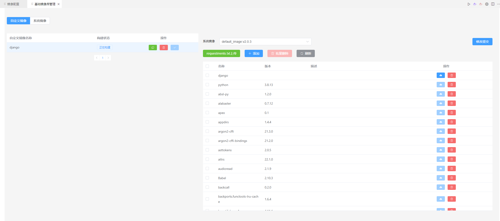

# 配置镜像

镜像可以理解为项目运行所在的环境，类似anaconda的env

## 配置个人镜像环境

点击右上角**镜像配置**按钮，镜像配置界面如下：

> * 镜像名称
>   * 自定义镜像的名称，建议格式如 image_name:v1
> * 基础镜像
>   * 选择已构建的镜像为基础镜像，建议选择系统镜像
> * 镜像库列表
>   * 选择基础镜像后，表中会列出该镜像中的所有已安装库及其版本，
      用户可据此查看是否缺少库或需要更新部分库。
> * 添加库
>   * 点击**requirements上传**按钮，选择相应requirements文件上传，
>     其中的库就会更新到库列表中
>   * 点击**添加**按钮，可在公共仓库中搜索所需库并添加到列表中
> * 保存镜像
>   * 点击右下角的**保存镜像**按钮，就会开始构建镜像

## 镜像库管理
点击右上角**基础镜像库管理**按钮，可查看镜像构建进度，界面如下：

当镜像的构建状态变为**构建成功**后，用户可以在启动编辑界面或提交任务时，
在自定义镜像中选择构建成功的镜像